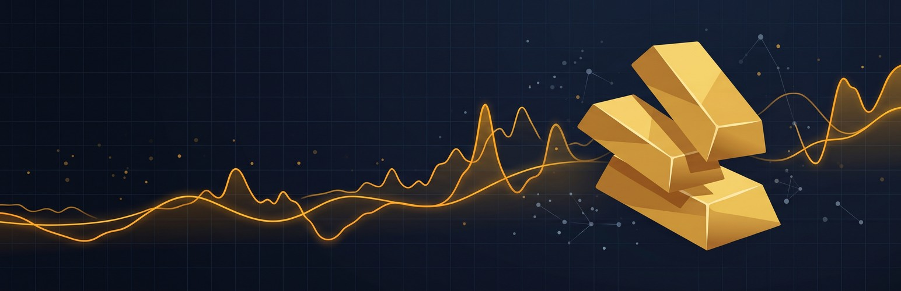
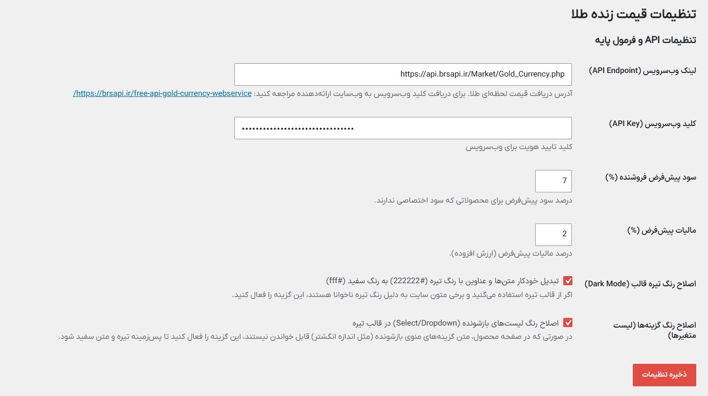

<p align="center">
  
</p>

# افزونه قیمت لحظه‌ای طلا و سکه برای ووکامرس | Live Gold Price

<p align="center">
  
</p>

[](https://wordpress.org/plugins/live-gold-price/)
[](https://wordpress.org/plugins/live-gold-price/)
[](https://wordpress.org/plugins/live-gold-price/)
[](https://www.gnu.org/licenses/gpl-2.0.html)
[](https://woocommerce.com/)

**افزونه قیمت لحظه‌ای طلا برای ووکامرس (Live Gold Price)** یک راهکار تخصصی، امن و کاملاً استاندارد جهت اتصال مستقیم فروشگاه‌های اینترنتی طلا و جواهر به وب‌سرویس‌های رسمی استعلام نرخ زنده طلا و انواع مسکوکات بانکی است. این افزونه قیمت تمامی محصولات ساده و متغیر را بر اساس فرمول‌های رسمی صنف طلا و جواهر (شامل وزن، اجرت ساخت، سود فروشنده و مالیات بر ارزش افزوده) به‌صورت کاملاً خودکار در صفحات محصول، سبد خرید و برگه پرداخت به‌روزرسانی می‌نماید.

> 📥 **دانلود رایگان از مخزن رسمی وردپرس:**  
> [صفحه اختصاصی افزونه در WordPress.org](https://wordpress.org/plugins/live-gold-price/)

---

## فهرست مطالب
- [چگونه قیمت لحظه‌ای طلا و سکه را در ووکامرس خودکار کنیم؟](#چگونه-قیمت-لحظهای-طلا-و-سکه-را-در-ووکامرس-خودکار-کنیم)
- [اتصال به وب‌سرویس و دارایی‌های تحت پوشش](#اتصال-به-وبسرویس-و-داراییهای-تحت-پوشش)
- [پیش‌نمایش تصویری محیط افزونه](#پیشنمایش-تصویری-محیط-افزونه)
- [معماری فنی و پایداری عملکرد](#معماری-فنی-و-پایداری-عملکرد)
- [فرمول‌های استاندارد محاسبه قیمت طلا](#فرمولهای-استاندارد-محاسبه-قیمت-طلا)
- [هوک‌ها و مستندات توسعه‌دهندگان](#هوکها-و-مستندات-توسعەدهندگان)
- [راهنمای نصب و راه‌اندازی](#راهنمای-نصب-و-راهاندازی)
- [💖 حمایت از پروژه](#-حمایت-از-پروژه)
- [مشارکت و توسعه](#مشارکت-و-توسعه)
- [لایسنس و مجوز انتشار](#لایسنس-و-مجوز-انتشار)

---

## چگونه قیمت لحظه‌ای طلا و سکه را در ووکامرس خودکار کنیم؟

مدیریت دستی قیمت‌ها در بازار پرنوسان طلا و سکه همواره ریسک زیان مالی فروشندگان را افزایش می‌دهد. این افزونه فرآیند قیمت‌گذاری را بدون کوچک‌ترین تاخیر به صورت کاملاً خودکار درمی‌آورد:

1. **استعلام خودکار نرخ طلا:** نرخ‌های بازار در پس‌زمینه توسط کرون‌جاب وردپرس به شکل منظم دریافت و ذخیره می‌گردند.
2. **محاسبه دقیق فرمول رسمی طلا:** بر پایه وزن خالص محصول و ۳ مدل اجرت ساخت (درصدی، گرمی یا ثابت)، سود مجاز و مالیات بر ارزش افزوده لحاظ می‌شوند.
3. **همگام‌سازی آنی سبد خرید و پرداخت:** مبالغ سبد خرید و تسویه حساب با بالاترین اولویت (`priority: 9999`) بلافاصله قبل از پرداخت با آخرین نرخ استعلام‌شده به‌روزرسانی می‌شوند تا از هرگونه مغایرت قیمت جلوگیری گردد.

---

## اتصال به وب‌سرویس و دارایی‌های تحت پوشش

این افزونه به‌طور اختصاصی برای فروشگاه‌های آنلاین طلا، جواهرسازی، زرگری و صرافی‌های فعال در ووکامرس پیاده‌سازی شده است:

* **دارایی‌ها و مسکوکات تحت پوشش:**
  * طلای ۱۸ عیار
  * سکه تمام بهار آزادی طرح جدید (امامی)
  * سکه تمام بهار آزادی طرح قدیم
  * نیم سکه بهار آزادی
  * ربع سکه بهار آزادی
  * سکه گرمی بانکی
* **محاسبه هوشمند متغیرها:** محاسبه خودکار ویژگی‌های مختلف محصولات متغیر (مانند سایزهای انگشتر یا وزن‌های مختلف دستبند) از طریق AJAX و اندپوینت سبک REST API.
* **پشتیبانی کامل از HPOS:** سازگار رسمی با مخزن سفارشات پرسرعت ووکامرس (High-Performance Order Storage).

---

## پیش‌نمایش تصویری محیط افزونه

### پیشخوان مدیریت و مانیتورینگ نرخ‌های زنده
<p align="center">
  
</p>

---

## معماری فنی و پایداری عملکرد

```
[ وب‌سرویس خارجی طلا ]
        │ (WP-Cron فواصل ۱ دقیقه‌ای)
        ▼
[ حافظه موقت کش (۵۵ ثانیه) ] ──(در صورت قطعی وب‌سرویس)──► [ پشتیبان پایدار در دیتابیس ]
        │
        ▼
[ موتور محاسباتی افزونه ]
        │
        ├──► صفحه تکی محصول (استعلام ناهمگام REST API)
        ├──► لیست متغیرها (رویداد show_variation)
        └──► سبد خرید و تسویه حساب (woocommerce_before_calculate_totals: 9999)
```

### ۱. کشینگ هوشمند بدون افت سرعت لود سایت (Zero TTFB Overhead)
برای جلوگیری از کندی وب‌سایت و جلوگیری از بار اضافی روی سرور، نرخ‌ها به‌مدت **۵۵ ثانیه** در ترنزینت‌های وردپرس ذخیره می‌شوند. بازدیدکنندگان عادی هرگز درخواست خارجی مستقیم به وب‌سرویس ارسال نمی‌کنند.

### ۲. مکانیزم پایدار پشتیبان دیتابیس (Failover Protection)
در صورت قطعی اینترنت بین‌الملل، تاخیر یا مسدودی سرور ارائه‌دهنده وب‌سرویس، افزونه بی‌درنگ از آخرین نرخ معتبر ثبت‌شده در دیتابیس استفاده می‌کند تا فرآیند ثبت سفارش و فروش متوقف نشود.

### ۳. به‌روزرسانی بدون رفرش (Asynchronous REST API)
قیمت‌های صفحه محصول از طریق اندپوینت غیراسبک REST (`/wp-json/live-gold-price/v1/prices`) و به صورت نامتقارن استعلام می‌شوند؛ بنابراین با افزونه‌های کش مانند راکت (WP Rocket) و لایت‌اسپید (LiteSpeed Cache) سازگاری ۱۰۰٪ دارد.

---

## فرمول‌های استاندارد محاسبه قیمت طلا

فرمول پیاده‌سازی‌شده در موتور محاسباتی افزونه دقیقا مطابق فرمول مصوب صنف طلا و جواهر است:

$$\text{ارزش خام طلا} = \text{وزن (گرم)} \times \text{نرخ لحظه‌ای هر گرم}$$

$$\text{ارزش با اجرت} = \text{ارزش خام طلا} + \text{اجرت ساخت (درصدی، گرمی یا ثابت)}$$

$$\text{سود فروشنده} = \text{ارزش با اجرت} \times \left(\frac{\text{درصد سود}}{100}\right)$$

$$\text{مالیات بر ارزش افزوده} = (\text{ارزش با اجرت} + \text{سود فروشنده}) \times \left(\frac{\text{درصد مالیات}}{100}\right)$$

$$\text{قیمت نهایی} = \text{گردکردن}(\text{ارزش با اجرت} + \text{سود فروشنده} + \text{مالیات})$$

---

## هوک‌ها و مستندات توسعه‌دهندگان

افزونه شامل اکشن‌ها و فیلترهای استاندارد برای توسعه‌دهندگان و برنامه‌نویسان قالب‌های اختصاصی است:

### فیلتر شخصی‌سازی محاسبه نهایی قیمت (`live_gold_price_calculated_price`)
امکان دستکاری فرمول محاسبات برای سناریوهای خاص (مانند تخفیف همکار، حق بازاریابی یا تخفیف ویژه مشتریان وفادار):

```php
add_filter( 'live_gold_price_calculated_price', 'custom_modify_gold_calculated_price', 10, 6 );
/**
 * شخصی‌سازی قیمت محاسبه‌شده محصول طلا
 *
 * @param float $final_price       مبلغ نهایی گردشده
 * @param int   $product_id        شناسه محصول یا متغیر
 * @param float $base_gold_value   ارزش خام طلا (وزن ضربدر نرخ)
 * @param float $wage_amount       مبلغ اجرت محاسبه‌شده
 * @param float $profit_amount     مبلغ سود فروشنده
 * @param float $tax_amount        مبلغ مالیات بر ارزش افزوده
 * @return float
 */
function custom_modify_gold_calculated_price( $final_price, $product_id, $base_gold_value, $wage_amount, $profit_amount, $tax_amount ) {
    // مثال: اعمال ۲ درصد تخفیف اختصاصی برای مشتریان ویژه
    if ( current_user_can( 'vip_customer' ) ) {
        $final_price = $final_price * 0.98;
    }
    return round( $final_price );
}
```

### اکشن اجرای دستی کرون استعلام قیمت (`live_gold_price_fetch_prices_cron`)
جهت همگام‌سازی از طریق وب‌هوک، سرویس‌های خارجی یا ترمینال سرور:

```bash
# اجرا از طریق WP-CLI در محیط ترمینال
wp cron event run live_gold_price_fetch_prices_cron
```

---

## راهنمای نصب و راه‌اندازی

### روش ۱: نصب مستقیم از پیشخوان وردپرس (توصیه‌شده)
1. وارد پیشخوان وردپرس شوید.
2. به بخش **افزونه‌ها > افزودن** مراجعه فرمایید.
3. نام `Live Gold Price` را جستجو کنید.
4. روی **هم‌اکنون نصب کن** کلیک کرده و سپس افزونه را فعال نمایید.
5. از منوی پیشخوان، وارد بخش **قیمت زنده طلا** شده و کلید وب‌سرویس را ذخیره کنید.

### روش ۲: نصب از طریق فایل فشرده (ZIP)
1. فایل `live-gold-price.zip` را دانلود کنید.
2. پوشه استخراج‌شده را در مسیر `/wp-content/plugins/live-gold-price/` آپلود نمایید.
3. افزونه را در صفحه افزونه‌های وردپرس فعال کنید.

---

## 💖 حمایت از پروژه

این ابزار کاملاً رایگان و متن‌بازه. اگه کارتون رو راه انداخت و براتون مفید بود، با زدن یه ⭐ روی گیت‌هاب یا حمایت رمزارزی می‌تونید به ادامه‌ی این مسیر انرژی بدید:

* 🔹 **USDT (BEP20):** `0xd593ae9D32bEA690EC62460C54BF3951aFFF7803`
* 🔸 **USDT (TRC20):** `THaaHzoTwXfUfcrtYTDXRsMmk9qhnXa56M`
* 💳 **شماره کارت:** `5022291619360157`

---

## مشارکت و توسعه

از مشارکت، گزارش باگ‌ها و ارسال Pull Request همواره استقبال می‌شود:
1. این مخزن را Fork کنید.
2. یک شاخه برای قابلیت جدید بسازید (`git checkout -b feature/NewFeature`).
3. تغییرات را Commit کنید (`git commit -m 'Add NewFeature'`).
4. تغییرات را Push کنید (`git push origin feature/NewFeature`).
5. یک Pull Request جدید ارسال نمایید.

---

## لایسنس و مجوز انتشار

این افزونه تحت لایسنس عمومی **GNU General Public License v2.0 or later** منتشر شده است. استفاده، بازنشر و توسعه آن با رعایت شروط این لایسنس کاملاً آزاد و رایگان است.
